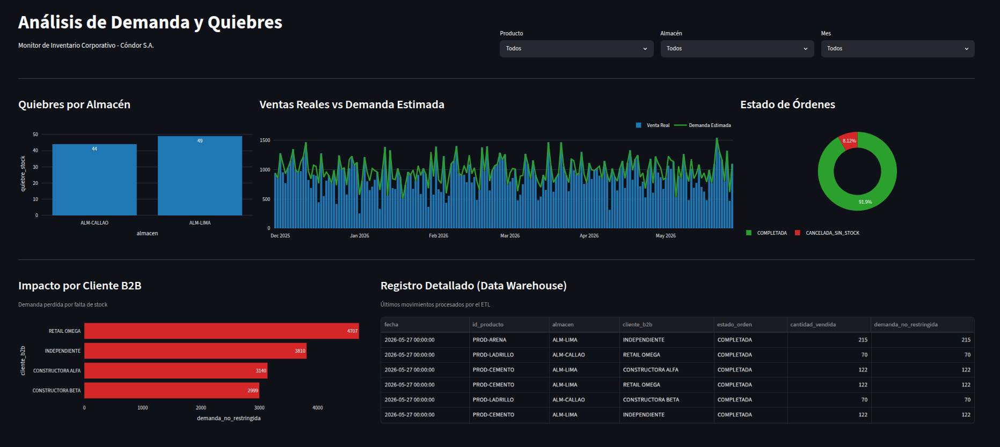

# ETL & MLOps Sandbox: Pipeline de Demanda de Inventario

Este repositorio es un entorno de práctica (Proof of Concept) enfocado en implementar buenas prácticas de **Data Engineering** y **MLOps**. El objetivo del proyecto es construir un flujo ETL robusto que resuelva el problema de datos censurados (ventas en cero por quiebre de stock), preparándolos para futuros modelos de Machine Learning.

## Objetivos de la Práctica

* **Infraestructura como Código (IaC):** Contenerización de servicios usando Docker y orquestación de bases de datos aisladas con Docker Compose.
* **Calidad de Código y CI:** Implementación de pruebas automatizadas (Unitarias y SUT) con `pytest` y bases de datos efímeras en RAM (`tmpfs`).
* **Automatización:** Estandarización del flujo de trabajo local y despliegue usando `Makefiles`.
* **Visualización de Datos:** Creación de un dashboard analítico web interactivo utilizando Streamlit y Plotly.

## Arquitectura del Pipeline

El proyecto abstrae la complejidad en tres componentes principales:

1. **ETL (Python):** Script basado en el patrón de diseño `Builder` para la limpieza, cruce relacional y cálculo estadístico de la "Demanda No Restringida".
2. **Data Warehouse (PostgreSQL):** Motor de base de datos relacional (desplegado en contenedor) para el almacenamiento persistente de los datos procesados.
3. **Frontend Analítico (Streamlit):** Interfaz web corporativa que consume la base de datos en tiempo real, aplicando el patrón de diseño visual en Z.

## Stack Tecnológico

| Categoría | Herramientas |
| --- | --- |
| **Lenguaje Core** | Python 3.12 |
| **Procesamiento de Datos** | Pandas, Numpy |
| **Base de Datos** | PostgreSQL, SQLAlchemy, psycopg2 |
| **Testing & QA** | Pytest, Pytest-env |
| **Visualización** | Streamlit, Plotly |
| **DevOps & Orquestación** | Docker, Docker Compose, GNU Make |

## Estructura del Proyecto

```text
.
├── data/                    # Datos crudos y generados sintéticamente
├── src/                     # Código fuente de la aplicación
│   ├── core/                # Configuraciones y conexión a BD
│   ├── dashboard/           # Aplicación visual (Streamlit)
│   └── utils/               # Utilitarios (generador de datos)
├── tests/                   # Suite de pruebas unitarias y de integración
├── Dockerfile               # Imagen base y multi-stage para el ETL/Tests
├── Dockerfile.dashboard     # Imagen independiente para la interfaz visual
├── docker-compose.yml       # Orquestación del entorno de Producción
├── docker-compose.test.yml  # Orquestación efímera para Integración Continua
├── Makefile                 # Panel de control de comandos
├── requirements.txt         # Dependencias de Python
└── README.md

```

## Guía de Ejecución

### Requisitos Previos

* Docker y Docker Compose instalados.
* Python 3.12+
* GNU Make

### 1. Clonación y Configuración Inicial

Abre tu terminal y ejecuta los siguientes comandos para preparar el entorno:

```bash
# Clona el repositorio
git clone https://github.com/frankhz28/inventario-etl-cd4ml.git
cd inventario-etl-cd4ml

# Crea y activa tu entorno virtual
python3 -m venv venv
source venv/bin/activate  # En Windows usa: venv\Scripts\activate

# Configura las variables de entorno seguras
cp .env.example .env

# Instalar requirements
pip install -r requirements.txt

```

### 2. Vía Rápida: Ejecución Automática (Recomendado)

Gracias a la orquestación implementada, puedes levantar todo el ecosistema con un solo comando. Esto ejecutará la limpieza, pasará las pruebas automatizadas en un entorno aislado, procesará el ETL y levantará el dashboard:

```bash
make all
```

### 3. Vía Paso a Paso: Modo Desarrollo

Si necesitas levantar, probar o depurar componentes de forma individual, utiliza los comandos modulares del Makefile:

1. **Instalar dependencias locales:**
    ```bash
    make setup
    ```


2. **Correr los tests de Integración Continua (SUT):**
    ```bash
    make test-ci
    ```


3. **Levantar SOLO la base de datos de producción:**
    ```bash
    make infra-up
    ```


4. **Ejecutar el pipeline ETL localmente:**
    ```bash
    make run-etl
    ```


5. **Levantar la interfaz visual (Streamlit):**
    ```bash
    make app-up
    ```


*(Una vez levantado, el dashboard estará disponible en `http://localhost:8501`)*

### 4. Limpieza y Apagado

Para detener el sistema y destruir los contenedores (conservando los volúmenes de datos):

```bash
make app-down
```

Para realizar una limpieza profunda (cachés, temporales y destrucción de volúmenes persistentes):

```bash
make down-docker
make clean
```

## Dashboard Analítico

Panel interactivo que demuestra el impacto financiero de la ceguera del ERP y visualiza la oportunidad perdida por quiebres de stock.


